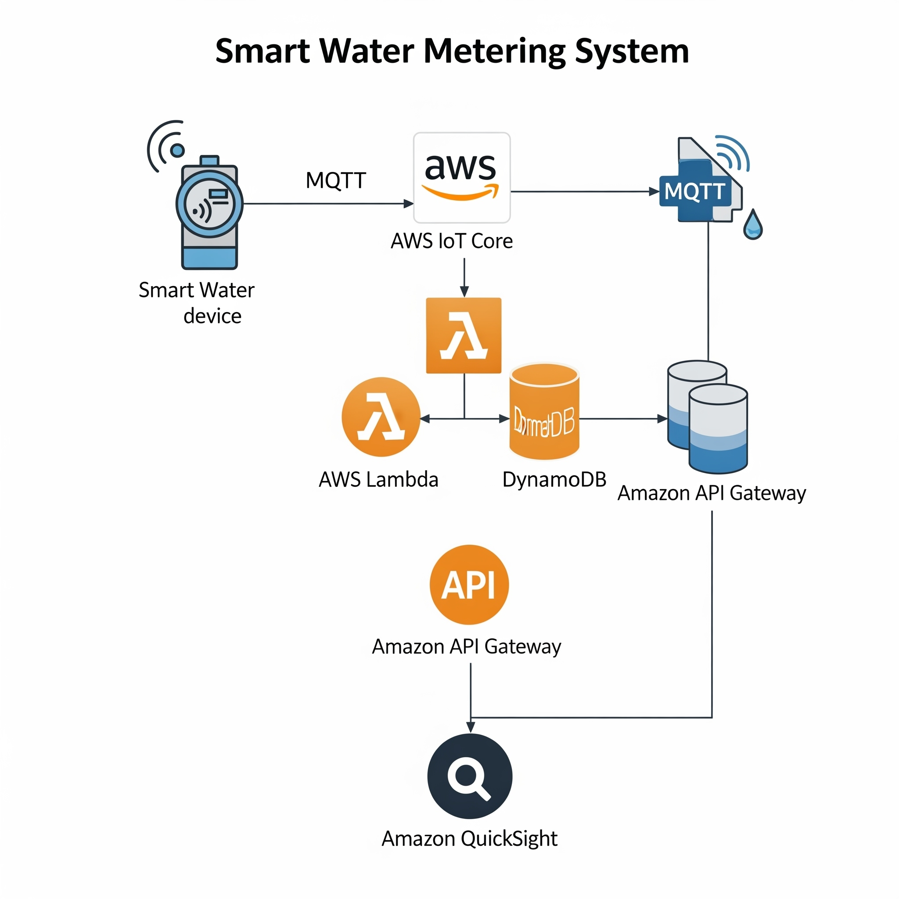
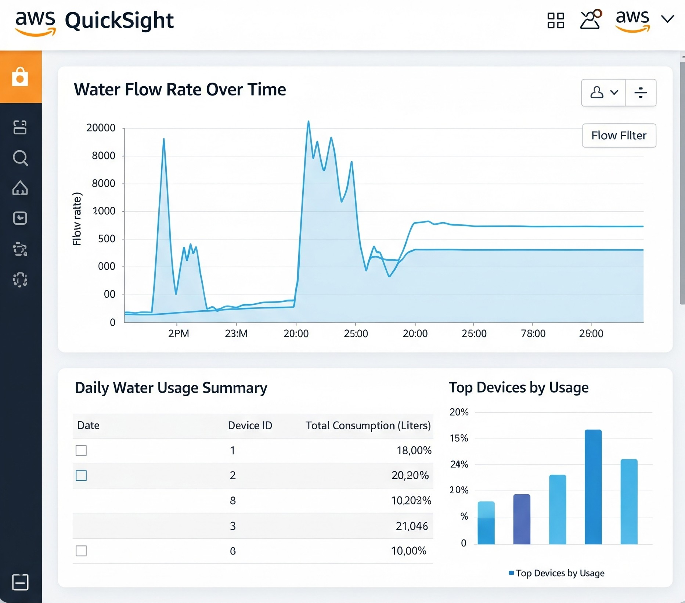
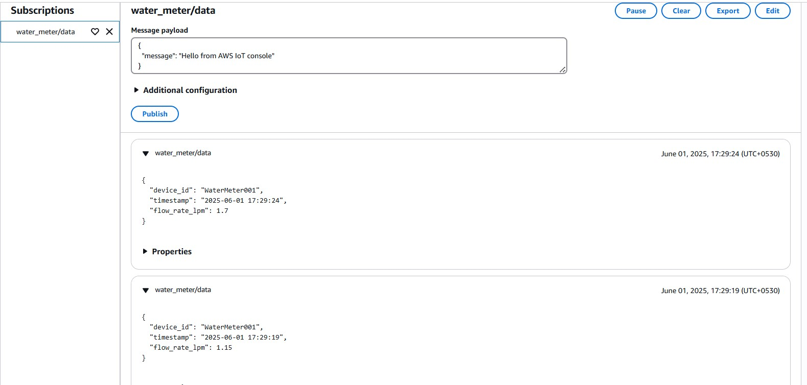
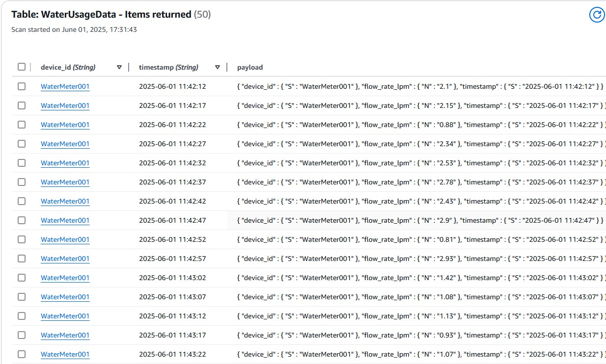
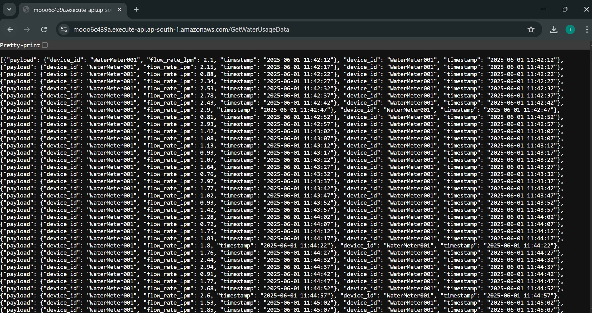

# 💧 Cloud-IoT-Based Smart Water Metering and Usage Analytics System

## 📘 Overview
This project implements a **Smart Water Metering System** using **IoT and AWS Cloud Services**.  
It allows real-time monitoring of water usage, data analytics, and visualization using a cloud dashboard.  
The goal is to automate water management and promote resource efficiency.

---

## 🧠 Technologies Used
- **IoT (NodeMCU / Flow Sensor)**
- **MQTT Protocol**
- **AWS IoT Core**
- **AWS Lambda**
- **Amazon DynamoDB**
- **Amazon API Gateway**
- **Amazon QuickSight**
- **Python**

---

## ⚙️ Features
✅ Real-time data collection from IoT water meters  
✅ Secure data transmission via MQTT  
✅ Serverless data storage using AWS Lambda + DynamoDB  
✅ REST API integration with AWS API Gateway  
✅ Dashboard visualization using Amazon QuickSight  
✅ Scalable, cost-effective, and low-maintenance cloud solution

---

## 🧩 System Architecture
Below is the overall system flow:

1. IoT device measures flow rate using a water flow sensor.  
2. Data is published via **MQTT** to **AWS IoT Core**.  
3. AWS **Lambda function** processes and stores data in **DynamoDB**.  
4. **API Gateway** retrieves data for web and mobile clients.  
5. **Amazon QuickSight** visualizes real-time and historical usage.

### 📊 Architecture Diagram
<p align="center">
  
</p>

## 🧾 Sample Data
```json
{
  "device_id": "WaterMeter001",
  "timestamp": "2025-06-01 11:42:12",
  "flow_rate_lpm": 2.15
}
```

---


## 📊 Dashboard (Amazon QuickSight)

This dashboard provides a visual overview of real-time and historical water usage.  
It includes:
- Water flow rate over time  
- Daily consumption summary  
- Top devices by usage  
- Trend analysis for anomaly detection  

### 📈 Dashboard Preview

<p align="center">
  
</p>
---

## 📡 MQTT Output (AWS IoT Test Client)

Below is a sample MQTT message received from the water meter device on the topic `water_meter/data`.

<p align="center">
  
</p>
---

## 🗄️ DynamoDB Data Storage

The DynamoDB table **WaterUsageData** stores all water meter readings in real-time.  
Each entry contains:
- `device_id`  
- `timestamp`  
- `flow_rate_lpm`  

### 📄 DynamoDB Table Screenshot
<p align="center">
  
</p>
---

## 🔗 API Gateway Output (REST API)

The REST API endpoint retrieves real-time and historical usage data stored in DynamoDB.  
The API was implemented using **AWS Lambda** and **API Gateway**.

### 📡 GET /GetWaterUsageData
This endpoint returns:
- `device_id`
- `timestamp`
- `flow_rate_lpm`

### 📄 API Response Screenshot
<p align="center">
  
</p>
---
